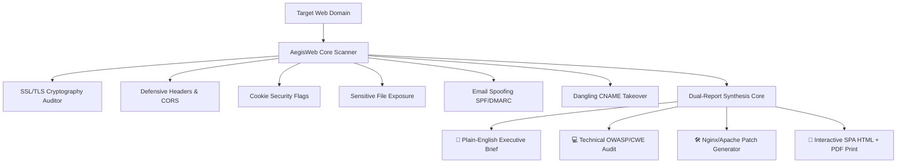

<div align="center">

  <!-- Hero Header Banner -->
  

  <p align="center">
    <strong>Enterprise-Grade Automated Web Security Auditor, Vulnerability Scanner & Dual-Report Engine in Python</strong>
  </p>

  <p align="center">
    <a href="https://github.com/Saura0S/AegisWeb/actions">
      
    </a>
    
    
    
    
  </p>

</div>

---

## ⚡ Overview

**AegisWeb** is an automated, non-intrusive web security posture auditor and vulnerability assessment suite. It bridges the gap between technical security engineering and executive decision-making through its unique **Dual-Audience Reporting Core**:

1. 👔 **Executive / Business Risk Report**: Translates technical flaws into plain English explaining **"What is this issue?"**, **"Why is this dangerous for your website?"**, and **"How to fix it?"**.
2. 💻 **Technical Security Engineering Report**: Provides raw HTTP evidence, OWASP Top 10 / CWE tags, SSL cipher verification, and ready-to-paste **Nginx** & **Apache** configuration fixes.

---

## 🌟 Key Capabilities

* 🔒 **SSL/TLS Cryptographic Audit**: Evaluates certificate validity, days until expiration, and insecure deprecated protocols.
* 🛡️ **Defensive Security Headers & CORS**: Audits HSTS, CSP, X-Frame-Options (Clickjacking defense), MIME sniffing, Referrer-Policy, and wildcard CORS credentials.
* 🍪 **Cookie & Session Security**: Inspects `Set-Cookie` attributes for `Secure`, `HttpOnly`, and `SameSite` flags.
* 📁 **Sensitive File Exposure Detector**: Non-intrusively tests for publicly exposed `/.env`, `/.git/HEAD`, `/backup.sql`, `/phpinfo.php`, and swagger documentation.
* 📧 **Email Spoofing Defense**: Validates **SPF** and **DMARC** DNS records to check if cybercriminals can spoof emails from your domain.
* 🎯 **Subdomain Takeover Detector**: Detects dangling CNAME records pointing to abandoned cloud infrastructure (AWS S3, GitHub Pages, Heroku, Azure).
* 🕷️ **Internal Route & Auth Portal Crawler**: Discovers login portals, admin interfaces, and API routes.
* 🛠️ **Auto-Patch Code Generator**: Synthesizes ready-to-paste configuration blocks for Nginx, Apache, and `.htaccess`.
* 📄 **Interactive SPA HTML Report**: Features live tabs (Executive vs Technical) and a one-click **Print / Save as PDF** engine.

---

## 🏗️ Architecture



---

## 📥 Installation

```bash
# Clone the repository
git clone https://github.com/Saura0S/AegisWeb.git
cd AegisWeb

# Install dependencies
pip install -r requirements.txt

# Install as global CLI tool (optional)
pip install -e .
```

---

## 🚀 Usage Guide

### Basic Web Security Audit
```bash
python -m aegisweb.cli -u example.com
```

### Full Audit Generating All Reports (HTML, Plain-English MD & JSON)
```bash
python -m aegisweb.cli -u example.com --all-reports -o my_scan
```

### Audit with Internal Route Discovery & Authentication Crawler
```bash
python -m aegisweb.cli -u example.com --crawl --all-reports
```

---

## 🛠️ CLI Options

| Flag | Argument | Description | Default |
| :--- | :--- | :--- | :--- |
| `-u` | `--url` | Target URL or domain to audit *(Required)* | — |
| `--all-reports` | `--all-reports` | Generate HTML, Plain-English, and JSON simultaneously | `False` |
| `--html` | `--html` | Generate interactive SPA HTML report with PDF print | `False` |
| `--plain` | `--plain` | Export client-ready Plain-English Executive Summary (`.md`) | `False` |
| `--json` | `--json` | Export full technical JSON dataset | `False` |
| `--crawl` | `--crawl` | Enable internal route & login portal crawler | `False` |
| `-o` | `--output` | Output filename prefix for exported files | `aegisweb_<domain>` |
| `--timeout` | `--timeout` | Request timeout in seconds | `6` |
| `-v` | `--version` | Display version information | — |

---

## 📊 Sample Executive Plain-English Output

```markdown
### 1. [HIGH Priority] Missing Automatic HTTPS Protection (HSTS)
- **What is this issue?** Your website doesn't strictly force browsers to only use encrypted HTTPS connections.
- **Why is this dangerous for your website?** If a user visits your website from public Wi-Fi (like an airport or coffee shop), an attacker can strip the encryption and intercept logins, credit cards, and private customer data.
- **How to fix it?** Add the HSTS header to your web server to instruct browsers to never load your website over unencrypted HTTP.
- **Business Impact:** High Risk — Potential customer data interception and compliance violation (PCI-DSS / GDPR).
```

---

## 🧪 Running Unit Tests

```bash
pytest -v
```

---

## ⚖️ Legal & Ethical Disclaimer

> [!WARNING]
> **AegisWeb** is designed strictly for authorized security assessments, defensive posture auditing, compliance verification, and educational research. Only audit domains and systems you have explicit, documented permission to assess.

---

## 👨‍💻 Author & Connect

Crafted with ⚡ by **Saurabh ([@Saura0S](https://github.com/Saura0S))**

* 📸 **Instagram**: [@SAURABH_xt_0](https://www.instagram.com/SAURABH_xt_0)
* 💬 **Discord Community**: [Join Server](https://discord.gg/523wGqAP4W)
* 🚩 **TryHackMe**: [Saura0S](https://tryhackme.com/p/Saura0S)